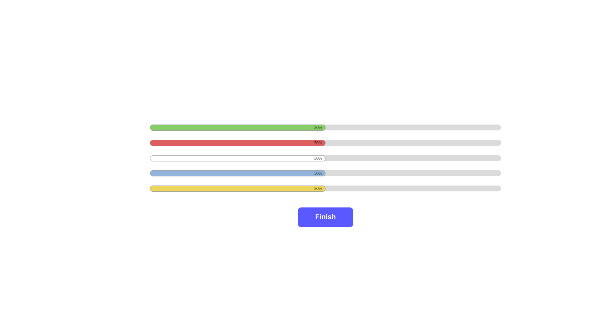

## Simple Progress Bar

### Description
This project is made in HTML, CSS and Vanilla Javascript
Live Link - https://edu58.github.io/progress-bars/

### Installing and running
To run the project, clone the repo or download the repo to your pc/mac. Unzip the files if zipped. If not zipped, you can skip this step.
Open the index.html file in your browser.
